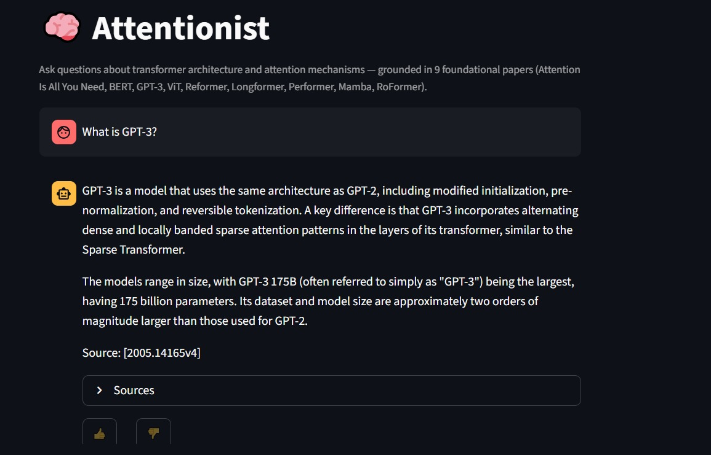

# 🧠 Attentionist

**Attentionist** is a Retrieval-Augmented Generation (RAG) assistant designed to answer questions about transformer architectures and attention mechanisms. It retrieves relevant passages from a curated collection of nine foundational research papers and uses **Google Gemini** to generate grounded, source-backed responses, helping reduce hallucinations and improve factual accuracy.

This project was developed as the final project for the **DataTalksClub LLM Zoomcamp 2026**.

---

## Demo



# ✨ Features

* 📚 Knowledge base built from **9 influential transformer and attention research papers**
* 🔍 Semantic retrieval using local ONNX vector embeddings + `minsearch`
* 🤖 Grounded answer generation with **Google Gemini**
* 💬 Interactive chat interface built with **Streamlit**
* 📖 Source citations for every generated response
* 👍👎 User feedback collection for response quality
* 📊 SQLite-based interaction monitoring
* 📈 Retrieval and generation evaluation pipeline
* 🐳 Dockerized deployment for reproducible execution

---

# 📄 Knowledge Base

Attentionist retrieves information from the following research papers:

* Attention Is All You Need
* BERT: Pre-training of Deep Bidirectional Transformers for Language Understanding
* Language Models are Few-Shot Learners (GPT-3)
* An Image is Worth 16×16 Words (Vision Transformer)
* Reformer
* Longformer
* Performer
* RoFormer
* Mamba

---

# 🏗️ Project Architecture

```text
                   User
                     │
                     ▼
            Streamlit Chat Interface
                     │
                     ▼
               User Question
                     │
                     ▼
          Query Embedding Generation
                     │
                     ▼
          Vector Search Retrieval (minsearch)
                     │
                     ▼
         Top-k Relevant Document Chunks
                     │
                     ▼
      Prompt Construction + Retrieved Context
                     │
                     ▼
               Google Gemini
                     │
                     ▼
        Grounded Answer + Source Chunks
                     │
                     ▼
      Interaction Logging & User Feedback
```

---

# ⚙️ Tech Stack

* Python
* Streamlit
* Google Gemini API (via OpenAI-compatible endpoint)
* `minsearch` (vector similarity search)
* Local ONNX embeddings (`all-MiniLM-L6-v2`)
* SQLite
* Docker
* Pandas
* NumPy

---

# 📁 Repository Structure

```text
Attentionist/
│
├── app/                     # Streamlit application
│   ├── app.py
│   └── monitoring.py
├── src/                     # Core RAG pipeline
│   ├── ingest.py
│   ├── embedder.py
│   ├── retrieval.py
│   ├── llm.py
│   └── rag.py
│
├── eval/                    # Evaluation pipeline
│   ├── generate_ground_truth.py
│   ├── evaluate_retrieval.py
│   ├── generate_rag_answers.py
│   ├── generate_norag_answer.py
│   ├── judge_answer.py
│   ├── select_judge_sample.py
│   └── results/
│
├── data/
│   ├── raw/
│   └── processed/
│
├── Dockerfile
├── .dockerignore
├── .env.example
├── requirements.txt
└── README.md
```

---

# 🚀 Installation

Clone the repository:

```bash
git clone https://github.com/malakhishams/Attentionist.git
cd Attentionist
```

Create a virtual environment:

```bash
python -m venv .venv
```

Activate it.

**Windows**

```bash
.venv\Scripts\activate
```

**Linux / macOS**

```bash
source .venv/bin/activate
```

Install the required dependencies:

```bash
pip install -r requirements.txt
```

---

# 📦 Embedding Model Setup (required)

This project uses a local ONNX embedding model (`all-MiniLM-L6-v2`) for retrieval, which is **not included in the repository** due to file size.

Download the model files and place them at `models/all-MiniLM-L6-v2/`:

* `model.onnx`
* `tokenizer.json`

Source: [Xenova/all-MiniLM-L6-v2 on Hugging Face](https://huggingface.co/Xenova/all-MiniLM-L6-v2)

The final folder structure should look like:
```text
models/
└── all-MiniLM-L6-v2/
    ├── model.onnx
    └── tokenizer.json
```

Once the files are in place, build the knowledge base index:

```bash
python src/ingest.py
```

---

# 🔑 Environment Variables

Copy the example environment file:

```bash
cp .env.example .env
```

Or, on Windows, manually create a `.env` file based on `.env.example`.

Then add your Gemini API keys (two keys are used to work around free-tier daily request limits — both are required for the app to run):

```text
GEMINI_API_KEY=your_api_key_here
NEW_GEMINI_API_KEY=your_second_api_key_here
```

---

# ▶️ Running the Application

Launch the Streamlit interface:

```bash
streamlit run app/app.py
```

Then open the local URL displayed in your terminal (typically `http://localhost:8501`).

---

# 🐳 Running with Docker

Build the Docker image:

```bash
docker build -t attentionist .
```

Run the container (both API keys are required):

```bash
docker run -p 8501:8501 \
  -e GEMINI_API_KEY=your_api_key_here \
  -e NEW_GEMINI_API_KEY=your_second_api_key_here \
  attentionist
```

Then open:

```text
http://localhost:8501
```

**Note:** the embedding model files (`models/`) must be present on the host and mounted or copied into the image, as described in the Embedding Model Setup section above.

Docker packages the application and all required dependencies into a portable container, ensuring the project runs consistently across different environments without requiring manual dependency installation.

---

# 📊 Evaluation Pipeline

The repository includes a complete evaluation workflow for both retrieval quality and answer quality.

### Generate Ground Truth

```bash
python eval/generate_ground_truth.py
```

### Evaluate Retrieval

Measures retrieval performance using **Hit Rate** and **Mean Reciprocal Rank (MRR)**, comparing two retrieval configurations:

```bash
python eval/evaluate_retrieval.py
```

**Results:**

| Configuration | Hit Rate | MRR |
|---|---|---|
| top_k = 5 | 35.90% | 0.281 |
| top_k = 10 | 53.85% | 0.306 |

Increasing `top_k` from 5 to 10 substantially improved Hit Rate, indicating that a meaningful share of correct chunks exist just beyond the top-5 cutoff. MRR improved only modestly, suggesting these additional chunks tend to rank lower rather than climbing near the top. This is consistent with observed sensitivity of the embedding model (`all-MiniLM-L6-v2`) to query phrasing versus the papers' own technical vocabulary.

### Generate RAG Answers

```bash
python eval/generate_rag_answers.py
```

### Generate Baseline (Without RAG)

```bash
python eval/generate_norag_answer.py
```

### LLM-as-a-Judge Evaluation

```bash
python eval/judge_answer.py
```

**Results (10 sampled questions per condition):**

| Condition | Average Score (1-5) |
|---|---|
| RAG | 5.0 |
| No-RAG (baseline) | 4.6 |

Evaluation outputs are stored in:

```text
eval/results/
```

---

# 📈 Monitoring

Every interaction is automatically logged into a lightweight SQLite database (`app/data/processed/monitoring.db`).

For each conversation, the system stores:

* Timestamp
* User question
* Generated answer
* Retrieved source documents
* Number of retrieved chunks
* Answer length
* User feedback (👍 / 👎)

These logs can be used to monitor system usage and evaluate response quality over time.

---

# ⚠️ Known Limitations

* **Ground-truth coverage**: due to Gemini free-tier API quota constraints during development, ground-truth generation completed for 5 of 9 papers (Attention Is All You Need, BERT, Reformer, Longformer, GPT-3). Retrieval and LLM-judge evaluation results above reflect this subset rather than the full 9-paper corpus.
* **LLM-as-judge groundedness**: the current judge prompt evaluates general factual correctness rather than fully differentiating whether an answer is grounded in the retrieved context specifically. The RAG vs. no-RAG comparison above should be read as a preliminary signal rather than a definitive measure of retrieval-added-value.
* **Query-phrasing sensitivity**: retrieval accuracy is sensitive to how closely a question's wording matches the papers' own technical vocabulary (e.g., "locality-sensitive hashing" retrieves more reliably than a paraphrase like "reduce attention complexity"), a known characteristic of general-purpose sentence embedding models like `all-MiniLM-L6-v2`.

---

# 💬 Example Questions

* What is self-attention?
* Explain multi-head attention.
* Why does BERT use masked language modeling?
* Compare BERT and GPT-3.
* How does Longformer reduce the complexity of self-attention?
* What are the key innovations introduced by Mamba?
* Which papers address the quadratic complexity of transformers?

---

# 📌 Future Improvements

* Complete ground-truth coverage across all 9 papers
* Fix and re-run LLM-as-judge with a groundedness-aware prompt
* Hybrid keyword + semantic retrieval
* Retrieval reranking
* Monitoring dashboard for feedback visualization
* Conversation memory
* Streaming responses
* Cloud deployment
* CI/CD pipeline with GitHub Actions

---

# 👩‍💻 Author

**Malak Hisham**

Computer Science Student at Ain Shams University

AI & Machine Learning Enthusiast

GitHub: https://github.com/malakhishams

---

# 🙏 Acknowledgements

* DataTalksClub LLM Zoomcamp
* Google Gemini
* Hugging Face
* Streamlit
* The authors of the transformer and attention research papers that form the project's knowledge base.